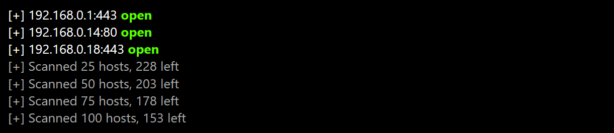

# Scan

Browser-based port scanning for fun and profit! 🥳👌

## Installation

```sh
vee oelin/scan
```

## Explanation

Scan is a simple script for finding open ports on internal and network hosts, all from within the context of a modern web browser. Scan makes use of APIs such as `Fetch` and `AbortController` to high-speed connect-based scans of a given IP/port range. Check out [this live demonstration](https://pscanjs.web.app).


